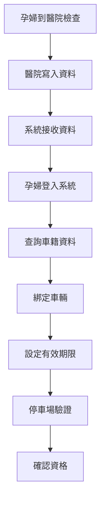
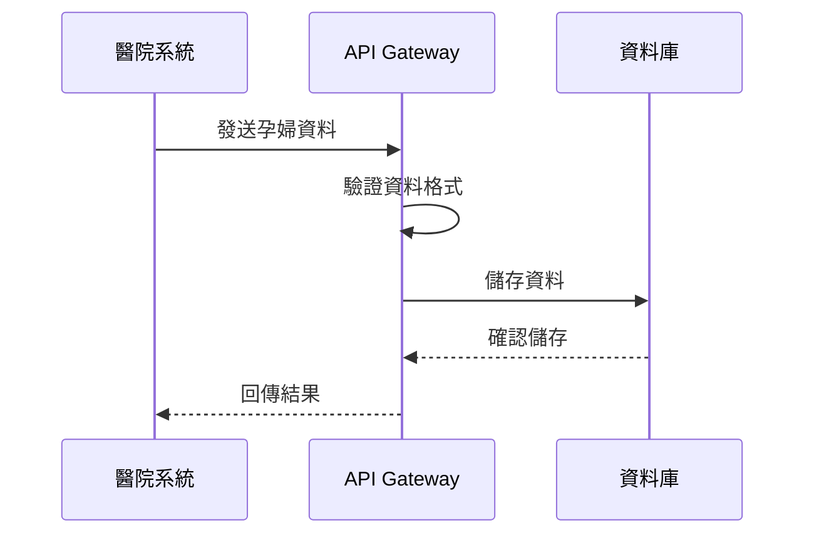
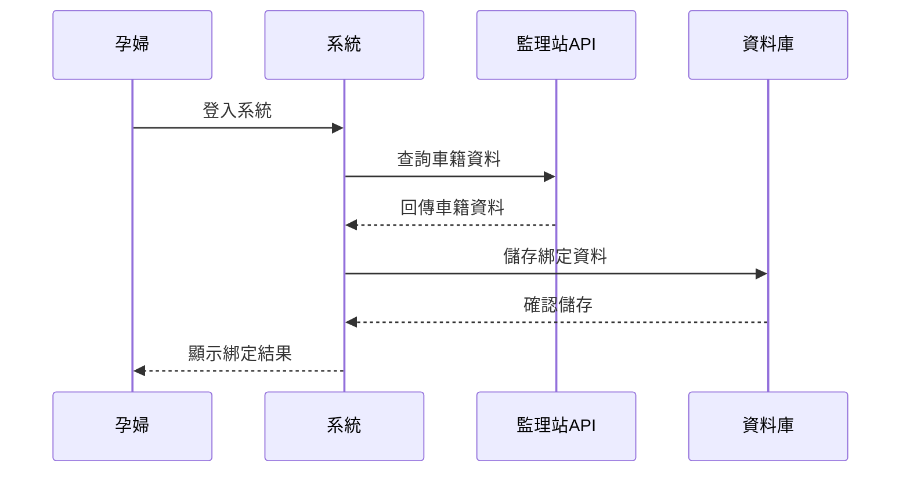
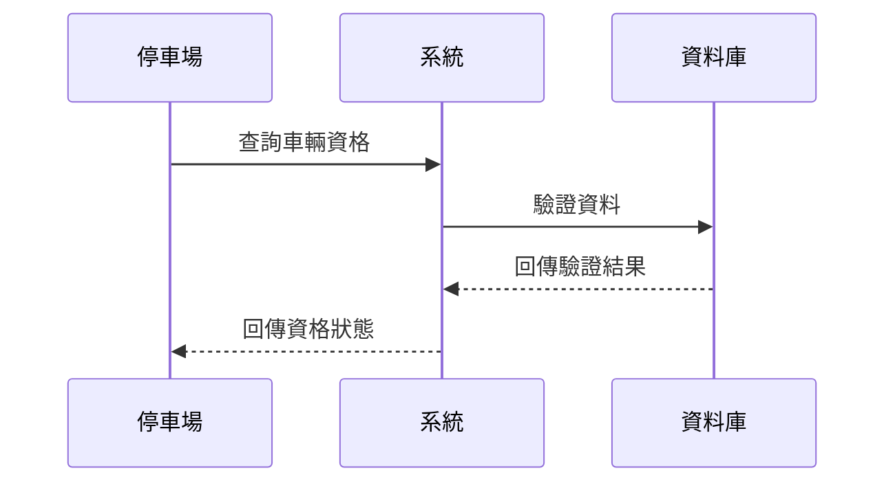
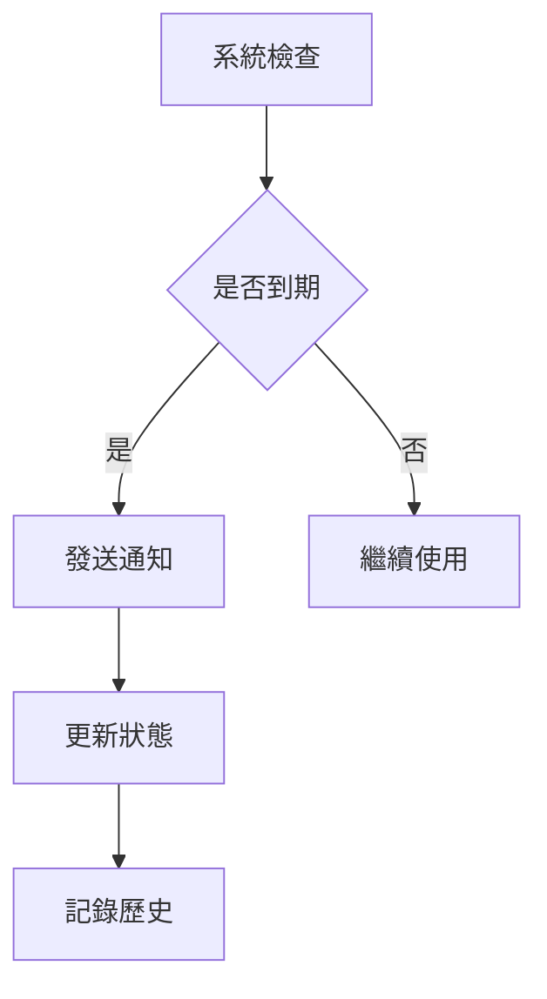

# 孕婦停車優惠系統流程圖

## 1. 整體系統流程

```mermaid
graph TD
    A[孕婦到醫院檢查] --> B[醫院寫入資料]
    B --> C[系統接收資料]
    C --> D[孕婦登入系統]
    D --> E[查詢車籍資料]
    E --> F[綁定車輛]
    F --> G[設定有效期限]
    G --> H[停車場驗證]
    H --> I[確認資格]
```

## 2. 醫院資料寫入流程

```mermaid
sequenceDiagram
    participant H as 醫院系統
    participant A as API Gateway
    participant D as 資料庫
    
    H->>A: 發送孕婦資料
    A->>A: 驗證資料格式
    A->>D: 儲存資料
    D-->>A: 確認儲存
    A-->>H: 回傳結果
```

## 3. 車輛綁定流程

```mermaid
sequenceDiagram
    participant P as 孕婦
    participant S as 系統
    participant M as 監理站API
    participant D as 資料庫
    
    P->>S: 登入系統
    S->>M: 查詢車籍資料
    M-->>S: 回傳車籍資料
    S->>D: 儲存綁定資料
    D-->>S: 確認儲存
    S-->>P: 顯示綁定結果
```

## 4. 停車場驗證流程

```mermaid
sequenceDiagram
    participant PL as 停車場
    participant S as 系統
    participant D as 資料庫
    
    PL->>S: 查詢車輛資格
    S->>D: 驗證資料
    D-->>S: 回傳驗證結果
    S-->>PL: 回傳資格狀態
```

## 5. 資料更新流程

```mermaid
graph TD
    A[系統檢查] --> B{是否到期}
    B -->|是| C[發送通知]
    B -->|否| D[繼續使用]
    C --> E[更新狀態]
    E --> F[記錄歷史]
``` 